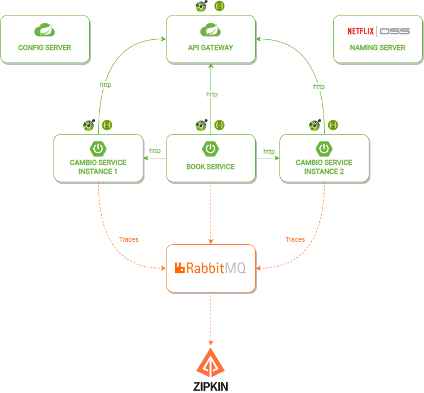

# Microservices-with-spring-cloud-spring-boot-and-docker

<!-- Shields Exemplo, existem N diferentes shield em https://shields.io/ -->


[](https://github.com/matheusslr/microservices-with-spring/actions/workflows/docker-publish.yml)



> Case study of a simple currency converter using a microservices environment approach in the Spring ecosystem

## Pre-requisites

Before running the project, make sure you have the following dependencies installed:

- `Java 17`. If not, you can download the `Java 17` [here](https://www.oracle.com/java/technologies/javase/jdk17-archive-downloads.html).
- `Apache Maven 3.9.2`. If not, you can download the `Apache Maven 3.9.2` [here](https://maven.apache.org/docs/3.9.2/release-notes.html).
- `Docker`. If not, you can download the `Docker` [here](https://www.docker.com/).

## How to run

Follow the steps below to run the project on your local machine:

Run the following commands from the root folder of the project:

### Clone this repository

```bash
git clone https://github.com/matheusslr/microservices-with-spring
```

### Install the dependencies
Enter the folders in the following pattern `03_*` and run the command in each one: 
```bash
mvn dependency:resolve
```

Alternatively, you can use the following scripts to download the project dependencies:

Linux:
```bash
.\build.sh
```
Windows:
```bash
.\build.bat
```

### Run the Project
Enter the folders in the following pattern `03_*` and run the command in each one:
```bash
mvn spring-boot:run
```

**Alternatively, you can run the project with:**
```bash
docker compose up
```

## Folder Structure

The project folder structure is organized as follows:

```text
|-- 03_book_service/
|-- |-- src/
|   |   |-- main/
|   |   |   |-- com/matheusslr/bookservice
|   |   |   |   |-- config
|   |   |   |   |-- controller
|   |   |   |   |-- model
|   |   |   |   |-- proxy
|   |   |   |   |-- repository
|   |   |   |   |-- response
|   |   |   |   |-- service
|   |-- resources
|   |   |-- db/migration
|   |   |-- application.yaml
|-- test/
|   |-- ...
```

## Back to the top

[⬆ Back to the top](#microservices-with-spring-cloud-spring-boot-and-docker)
